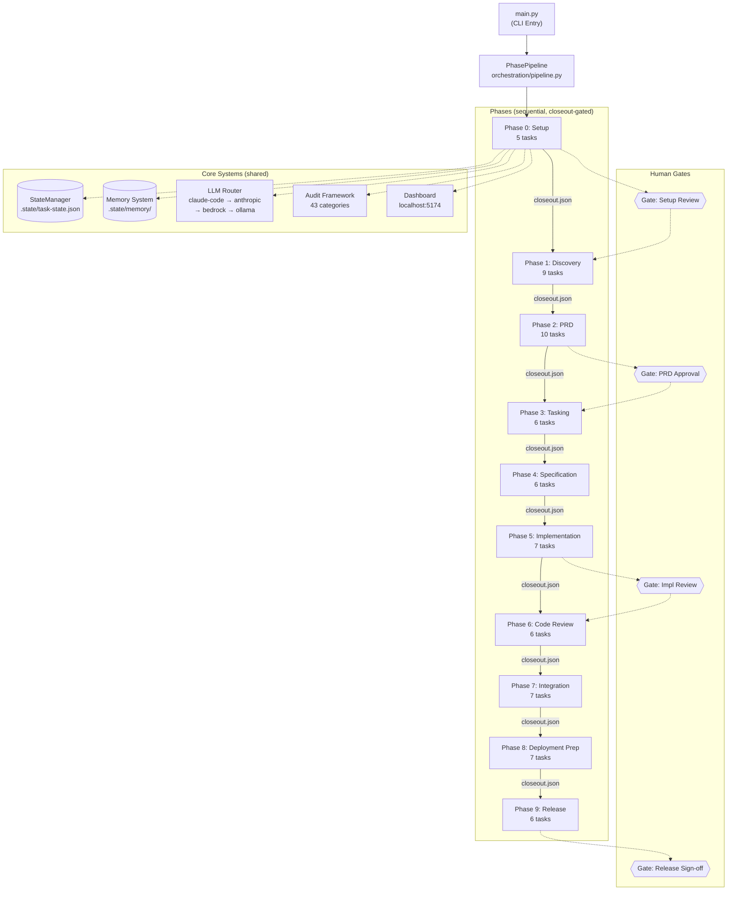

# Pipeline Overview

10-phase SDLC pipeline with sequential dependency gates and human checkpoints.



## Phase Transition Rules

- Each phase produces a `closeout.json` that the next phase validates on entry
- Human gates force interactive approval before proceeding
- `python main.py backtrack <phase> [task]` restores state snapshots
- Transition modes: AUTO (chain), PROMPT (ask), MANUAL (explicit)

## Artifact Flow Across Phases

```
Phase 0  →  project-config.json, provider-inventory.json, material-manifest.json
Phase 1  →  corpus-analysis.md, selected-approach.json, diagrams/
Phase 2  →  docs/prd/PRD.md (15 sections), prd-validation.json
Phase 3  →  .taskmaster/tasks/tasks.json, work-packages.json, dependency-graph.json
Phase 4  →  .openspec/spec-t*.json, tasks.json (with TDD subtasks)
Phase 5  →  test files, implementation files, tdd-progress.json, validation-report.json
Phase 6  →  findings.json, refinement-report.json, review-report.md
Phase 7  →  integration-test-results.json, approval.json
Phase 8  →  artifacts.json (changelog, docs, install guide), approval.json
Phase 9  →  announcement.md, execution.json, confirmation.json → PROJECT COMPLETE
```
