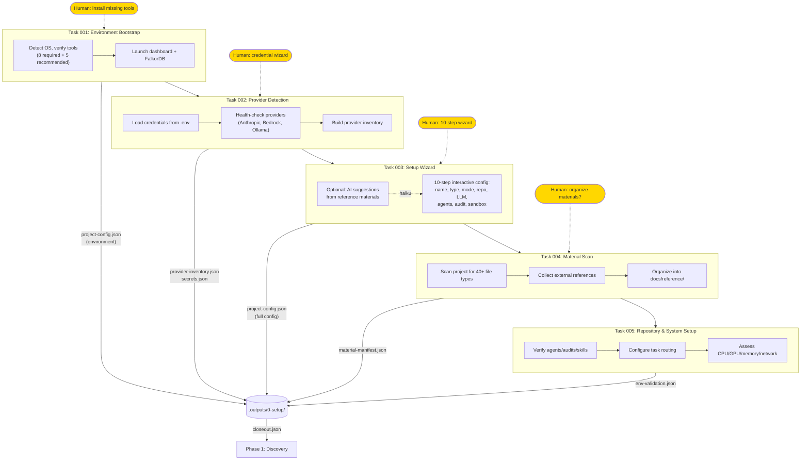

# Phase 0: Setup

Environment detection, provider configuration, project setup wizard, and system validation.

## Key Outputs

| File | Purpose | Consumers |
|------|---------|-----------|
| `project-config.json` | Project identity, type, LLM config, agent defaults | All phases |
| `provider-inventory.json` | Available LLM providers and health status | LLM Router |
| `secrets.json` | Credential flags (no secrets stored) | Task 003 |
| `material-manifest.json` | Scanned files and external references | Phase 1 Task 101 |
| `env-validation.json` | System capabilities, agent/audit counts | Closeout |
