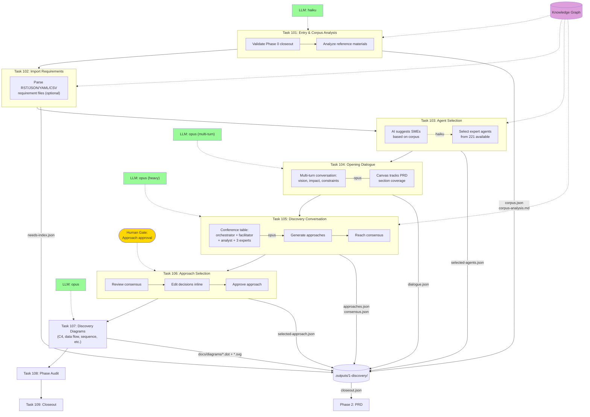

# Phase 1: Discovery

Requirements elicitation through corpus analysis, conversational dialogue, multi-agent deliberation, and approach selection.



## Data Flow Detail

```
Phase 0 project-config.json
    + docs/reference/ materials
        → Task 101: corpus-analysis.md
            → Task 104: dialogue context
                → Task 105: panel deliberation
                    → Task 106: selected-approach.json
                        → Phase 2 PRD authoring context
```

## LLM Usage

| Task | Model | Purpose |
|------|-------|---------|
| 101 | haiku | Corpus material analysis |
| 103 | haiku | Agent recommendations |
| 104 | opus | Multi-turn vision dialogue (min 3 turns) |
| 105 | opus | Multi-agent deliberation (heavy) |
| 107 | opus | Architecture diagram generation (DOT format) |
