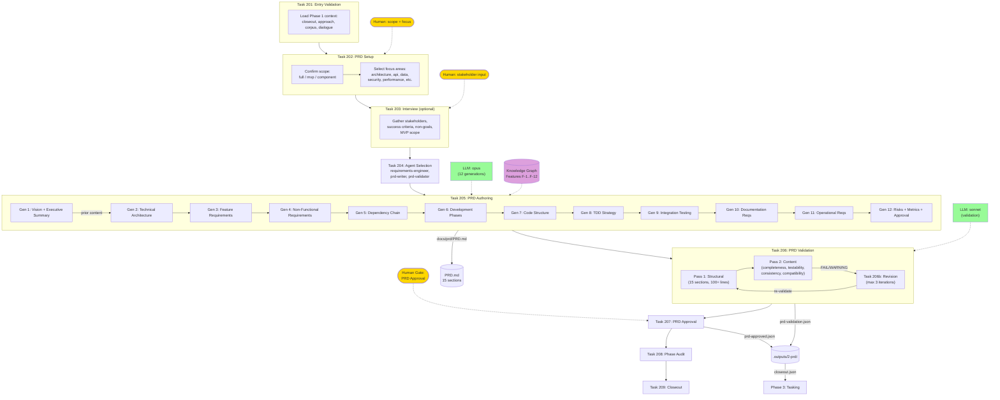

# Phase 2: PRD

15-section PRD authored in 12 LLM generations with guardian validation, followed by two-pass validation and human approval.

## Generation Detail

Each generation receives: project config + PRD setup + interview data + prior sections (capped at 12K chars). Guardian validation between each generation checks structure and content length.

| Gen | Sections | Model |
|-----|----------|-------|
| 1 | Vision, Executive Summary | opus |
| 2 | Technical Architecture | opus |
| 3 | Feature Requirements (FRs) | opus |
| 4 | Non-Functional Requirements (NFRs) | opus |
| 5 | Logical Dependency Chain | opus |
| 6 | Development Phases | opus |
| 7 | Code Structure & Organization | opus |
| 8 | TDD Requirements & Test Strategy | opus |
| 9 | Integration Testing Strategy | opus |
| 10 | Documentation Requirements | opus |
| 11 | Operational Requirements | opus |
| 12 | Risks, Success Metrics, Approval | opus |

## Validation Dimensions

| Dimension | What it checks |
|-----------|---------------|
| Completeness | All sections present, sufficient detail |
| Testability | RFC 2119 usage, measurable requirements |
| Consistency | No contradictions, consistent terminology |
| TaskMaster compatibility | Extractable dependency chains, explicit tech stack |
| OpenSpec compatibility | Can generate Gherkin scenarios |
