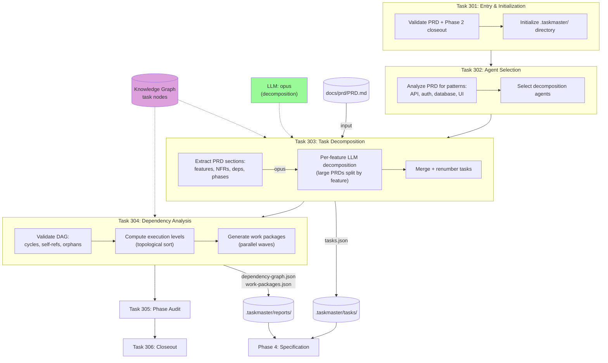

# Phase 3: Tasking

PRD decomposition into atomic tasks with dependency analysis and work package generation.



## Task Output Format

```json
{
  "id": 1,
  "title": "F0: Foundation Setup",
  "description": "...",
  "status": "pending",
  "priority": "high|medium|low",
  "category": "infrastructure|feature|testing|documentation|security",
  "dependencies": [2, 3],
  "acceptance_criteria": "...",
  "estimated_complexity": "simple|moderate|complex",
  "prd_section": "Section 3",
  "subtasks": []
}
```

## Work Package Structure

Tasks grouped into parallel execution waves based on dependency levels:

```
Wave 1 (Level 0): [T1, T2, T3]     ← root tasks, no dependencies
Wave 2 (Level 1): [T4, T5, T6, T7] ← depend on Wave 1
Wave 3 (Level 2): [T8, T9]          ← depend on Wave 2
```
