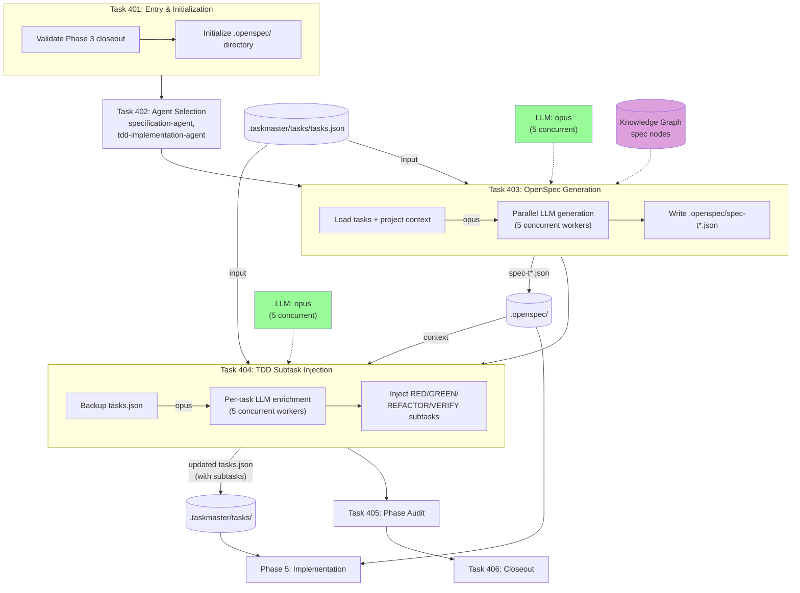

# Phase 4: Specification

OpenSpec generation for each task and TDD subtask injection (RED/GREEN/REFACTOR/VERIFY).



## OpenSpec Format

```json
{
  "spec_id": "SPEC-T1",
  "task_id": 1,
  "test_strategy": {
    "unit_tests": [{"name": "test_...", "description": "..."}],
    "integration_tests": [...],
    "scenarios": [{"given": "...", "when": "...", "then": "..."}]
  },
  "interfaces": {
    "inputs": [{"name": "...", "type": "...", "required": true}],
    "outputs": [{"name": "...", "type": "..."}],
    "errors": [{"code": "ERR_001", "condition": "..."}]
  },
  "edge_cases": [{"scenario": "...", "expected_behavior": "..."}],
  "security_requirements": [{"requirement": "...", "validation": "..."}]
}
```

## TDD Subtask Chain

Each task receives 4 ordered subtasks:

```
RED: Write failing tests     (deps: [])
  → GREEN: Minimal impl       (deps: [RED])
    → REFACTOR: Clean up       (deps: [GREEN])
      → VERIFY: Security scan  (deps: [REFACTOR])
```
