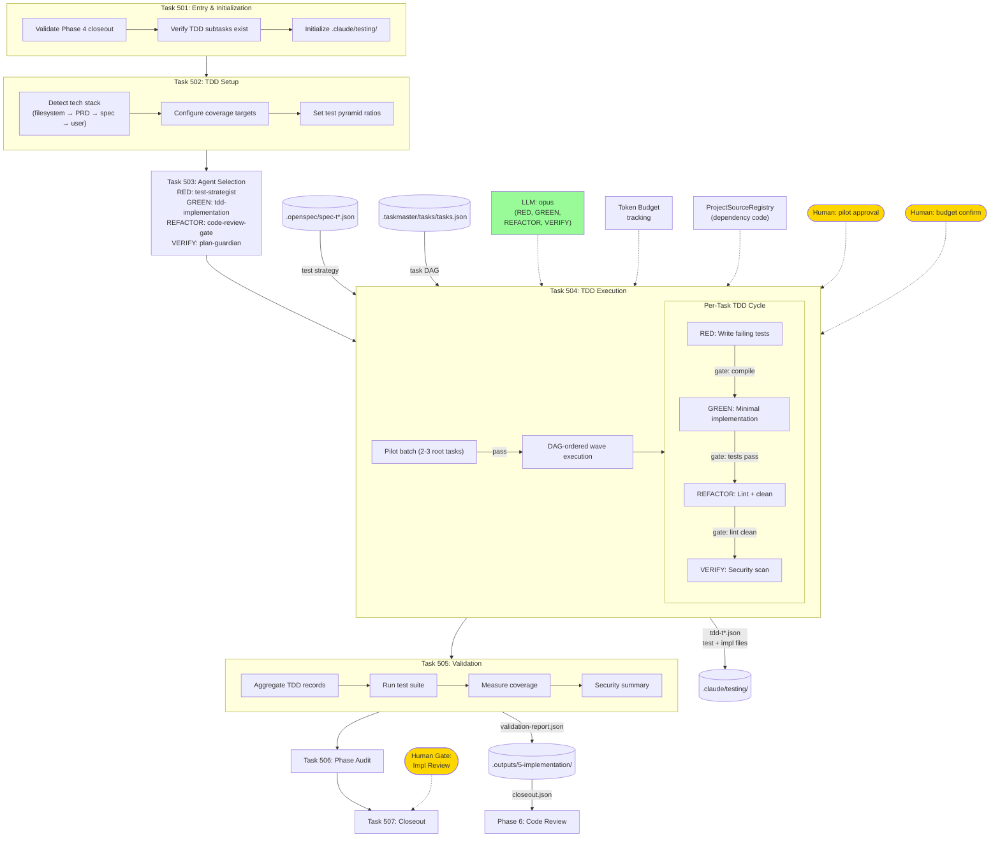

# Phase 5: Implementation

Stack-aware parallel TDD execution engine with DAG-ordered waves, pilot batches, and token budget tracking.

## Execution Strategy

1. **Pilot batch**: Run 2-3 root tasks first. If >50% fail, pause for review.
2. **DAG waves**: Tasks grouped by dependency level, parallel within each wave.
3. **Token budget**: Tracks cumulative spend, pauses before exceeding configured limit.
4. **Failure handling**: Per-task retry (max 3), cascading failure tracking.

## Stack Profiles

| Stack | Test Framework | Lint | Security | File Pattern |
|-------|---------------|------|----------|-------------|
| Python | pytest | py_compile | py_compile | `test_task_{id}.py` |
| Rust | cargo test | cargo clippy | cargo audit | `test_task_{id}.rs` |
| Node | jest | eslint | npm audit | `test_task_{id}.test.js` |
| Go | go test | go vet | go vet | `task_{id}_test.go` |

## Task Classification

- **bootstrap**: Project scaffold, CI setup (no deps, run first)
- **library**: Foundational types/traits (other tasks import these)
- **feature**: Application logic (typical tasks)
