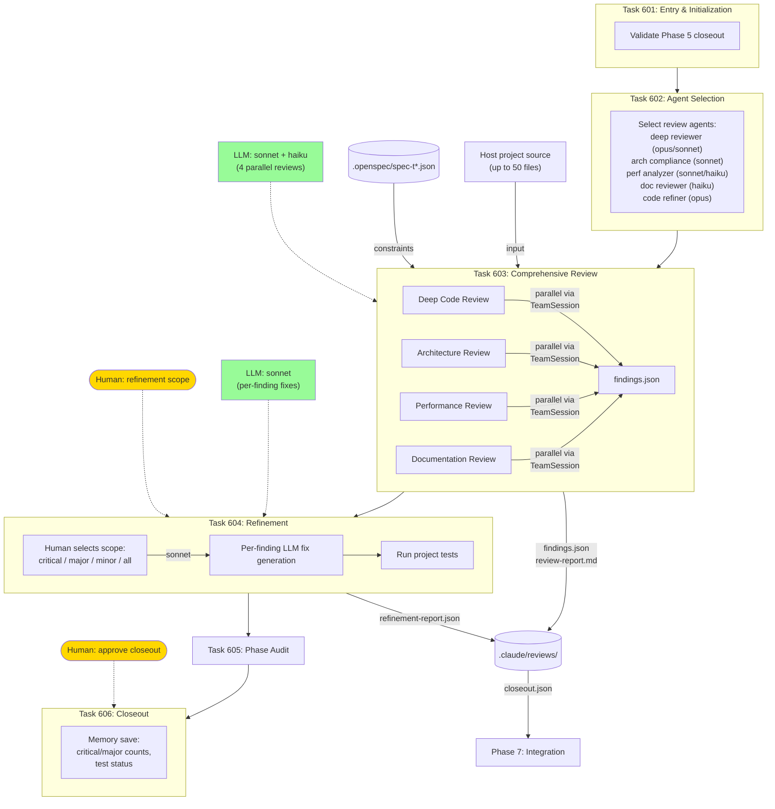

# Phase 6: Code Review

Four-dimensional code review (code, architecture, performance, documentation) with LLM-driven fix generation.

## Review Dimensions

| Dimension | Model | Focus |
|-----------|-------|-------|
| Deep Code | sonnet | Logic, correctness, patterns, error handling |
| Architecture | sonnet | Consistency with design, coupling, separation |
| Performance | haiku | Bottlenecks, memory, algorithmic complexity |
| Documentation | haiku | Coverage, accuracy, API docs |

## Finding Severity

Findings are categorized: **critical** > **major** > **minor** > **suggestions**.
Human chooses which severity levels to fix in Task 604.
