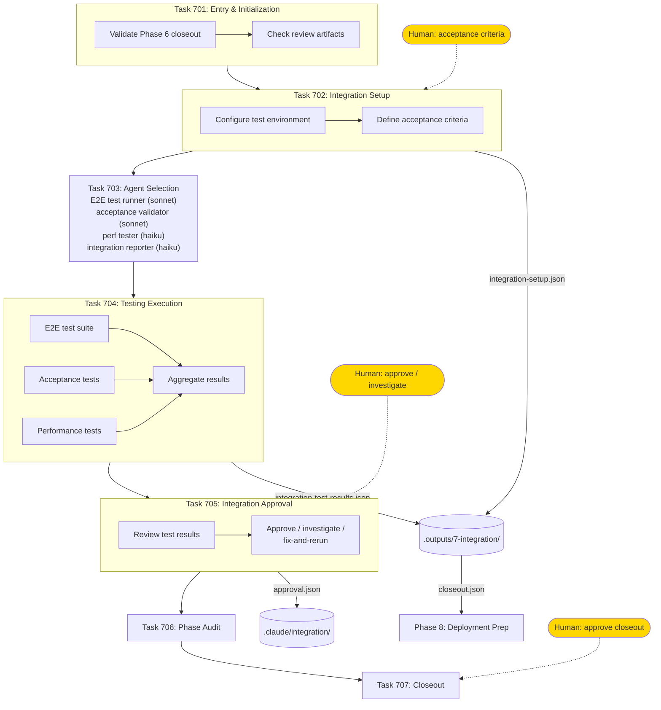

# Phase 7: Integration

Integration testing, acceptance validation, and human approval.

## Test Suites

| Suite | Scope | Metric |
|-------|-------|--------|
| E2E | Full user flows | tests passed / total |
| Acceptance | Business requirements | criteria met / total |
| Performance | Load and response time | within thresholds |
