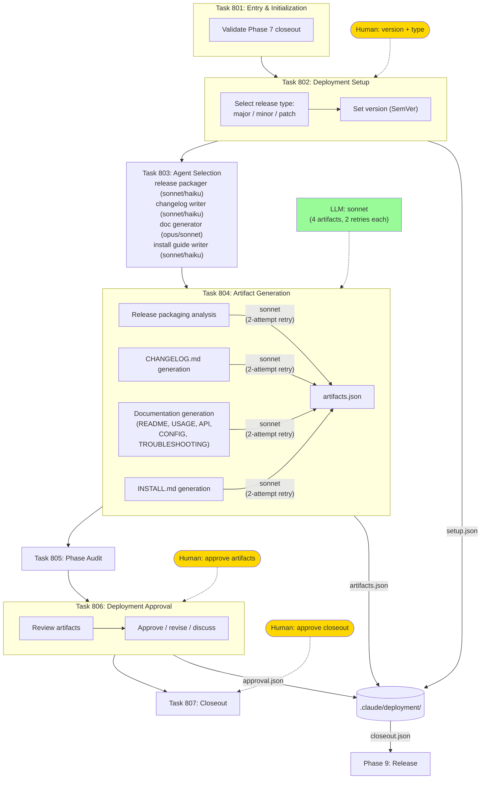

# Phase 8: Deployment Prep

Release artifact generation via LLM and deployment approval.

## Generated Artifacts

| Artifact | Format | Content |
|----------|--------|---------|
| Release package | tar.gz, wheel | Packaging analysis |
| Changelog | CHANGELOG.md | Keep a Changelog format |
| Documentation | 5 markdown files | User-facing docs |
| Install guide | INSTALL.md | Platform-specific instructions |
