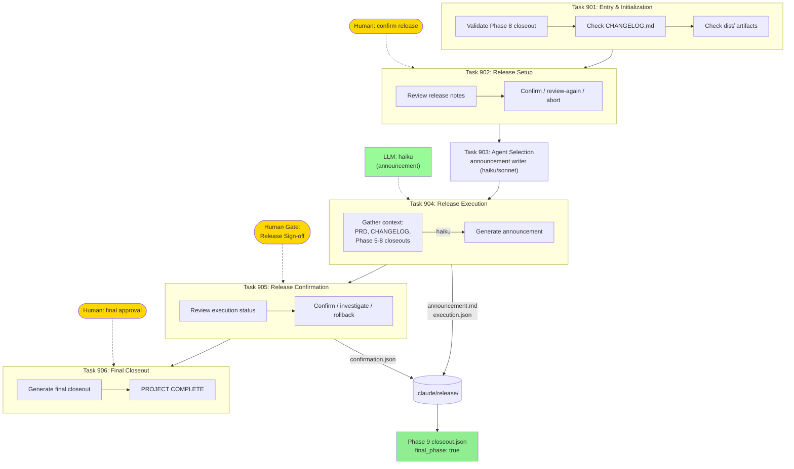

# Phase 9: Release

Final release execution, announcement generation, and project completion.



## Release Flow

```
Phase 8 artifacts (changelog, docs, install guide)
    → Task 902: Human confirms release notes
        → Task 904: LLM generates announcement
            → Task 905: Human confirms execution
                → Task 906: PROJECT COMPLETE
```
